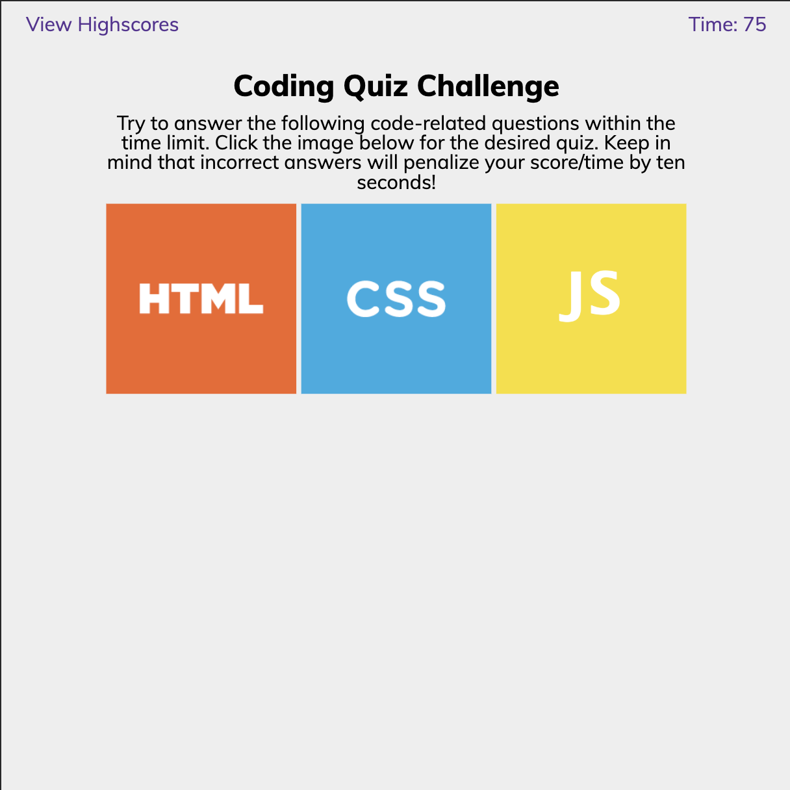
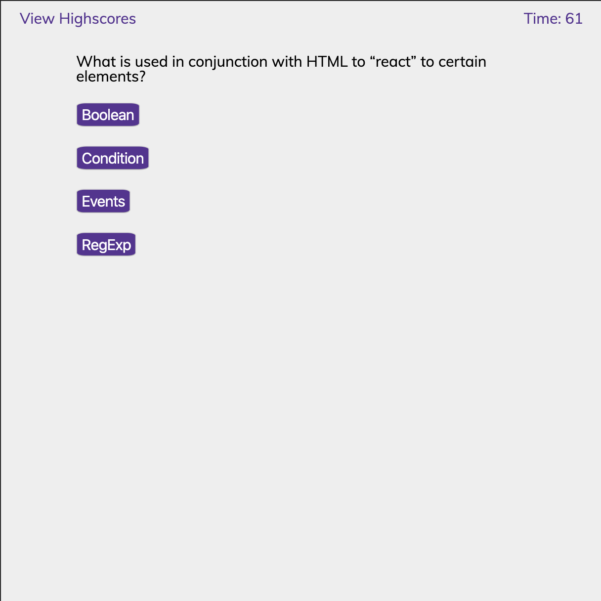
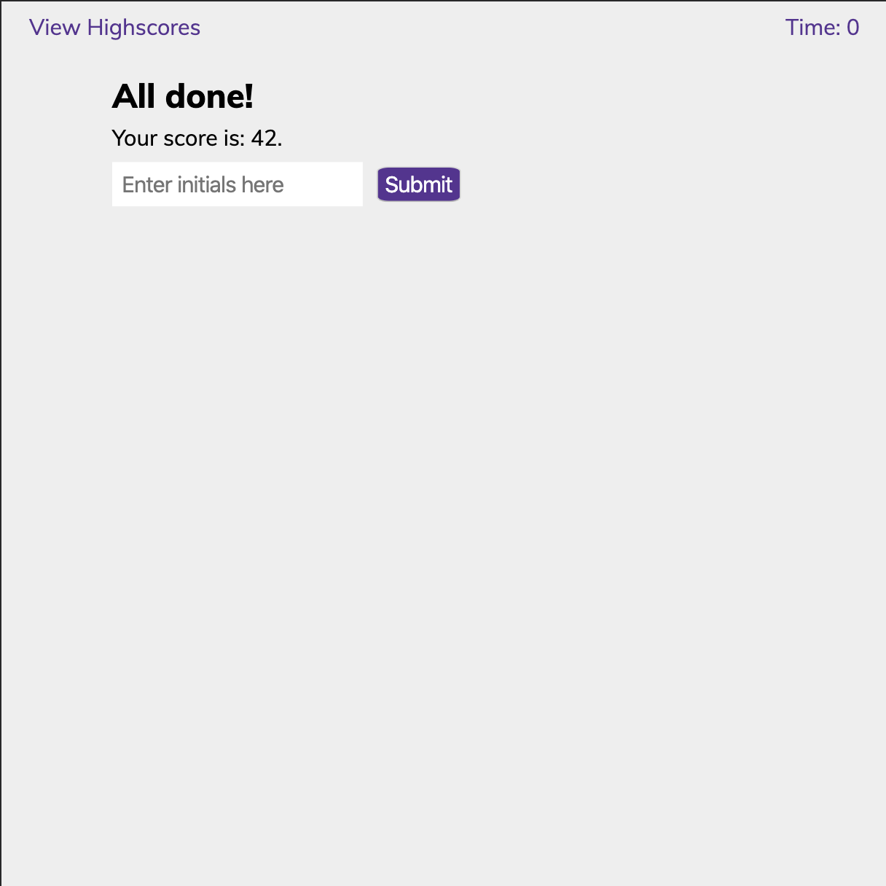

# Coding Quiz

## Description
This project is a quiz on different web languages. It includes a quiz for HTML, CSS, and JavaScript.

### Instructions
Select the image to choose which quiz you would like to take. Select your answer. If answer is incorrect, 15 seconds will be deducted from the timer. Score is calculated by time remaining once quiz is complete. Click the "View Highscores" button in the top left corner to see locally stored high scores. Click link in the footer to return back to landing page at any point that you would like to restart or take another quiz!

### Built With
* HTML
* CSS
* JavaScript
* jQuery

### Assignment
    From scratch, build a timer-based quiz application that stores high scores client-side.
