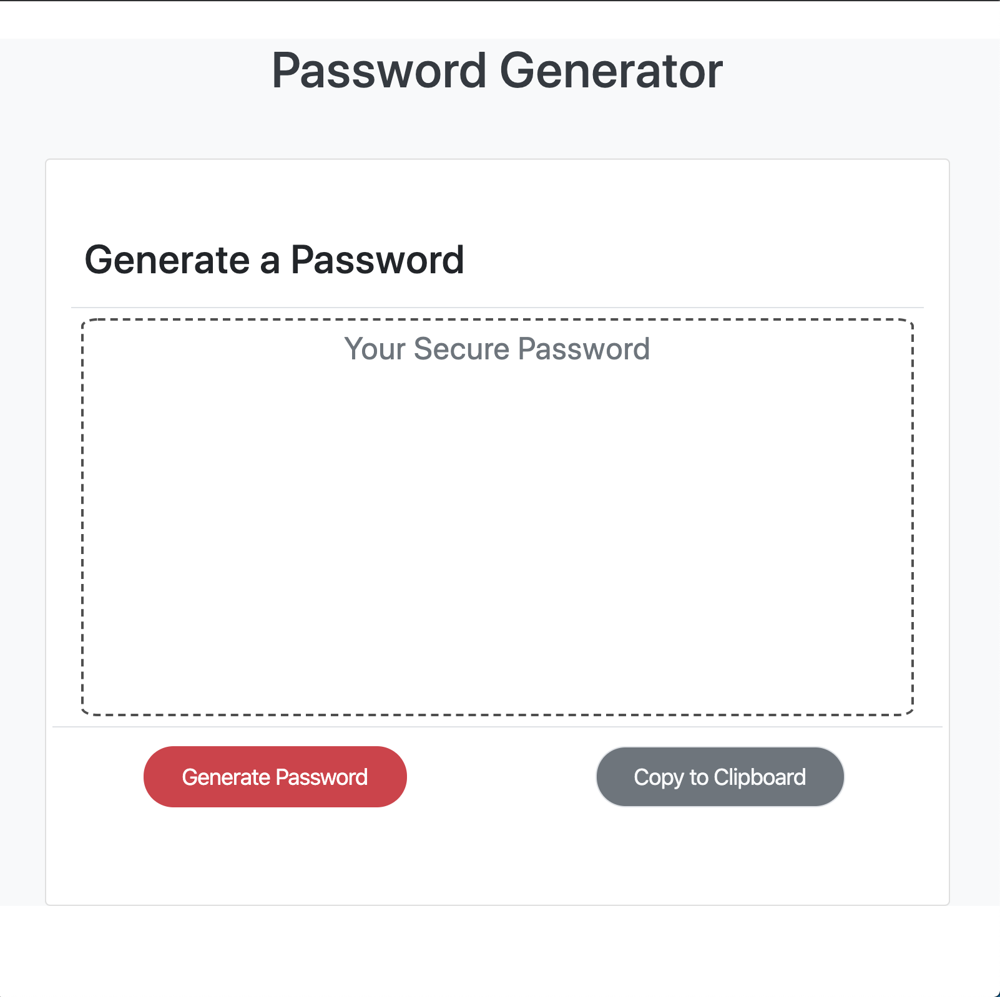

# Password Generator

## Getting Started
[Click to view the completed assignment.](https://taylormbruno.github.io/)

<<<<<<< HEAD

=======
##### The [Original Repositiory](https://github.com/taylormbruno/hwUnit02) before moving to live. Original commits can be found here.
>>>>>>> dfc71c2c536dd260fdc623c905301c5143beb3e8

##### The [Original Repositiory](https://github.com/taylormbruno/hwUnit03) before moving to live. Original commits can be found here.

## Assignment
>Create an application that generates a random password based on user-selected criteria. This app will run in the browser and feature dynamically updated HTML and CSS powered by your JavaScript code.

### Built With
- HTML
- CSS

<<<<<<< HEAD
### Credits
- [Bootstrap](https://getbootstrap.com/)
=======
## Credits
- [Bootstrap](https://getbootstrap.com/)

## Screenshots
    
>>>>>>> dfc71c2c536dd260fdc623c905301c5143beb3e8
