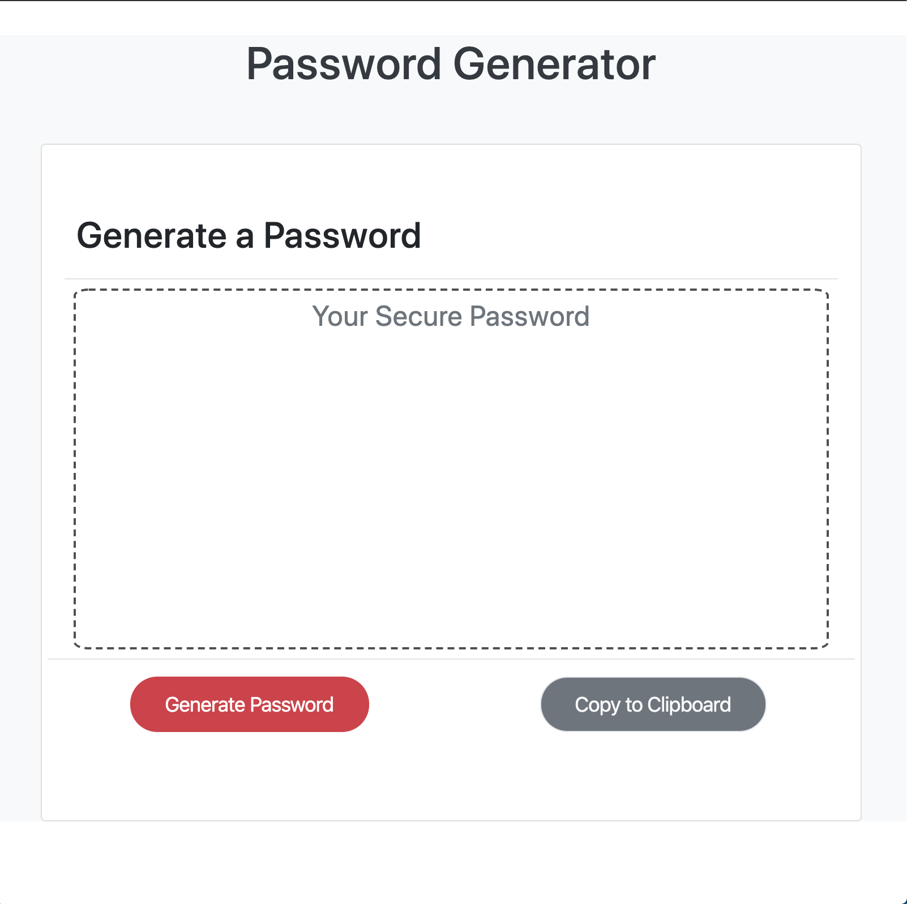

# Password Generator

## Getting Started
[Click to view the completed assignment.](https://taylormbruno.github.io/)

##### The [Original Repositiory](https://github.com/taylormbruno/hwUnit03) before moving to live. Original commits can be found here.

## Assignment
>Create an application that generates a random password based on user-selected criteria. This app will run in the browser and feature dynamically updated HTML and CSS powered by your JavaScript code.

### Built With
- HTML
- CSS

### Credits
- [Bootstrap](https://getbootstrap.com/)