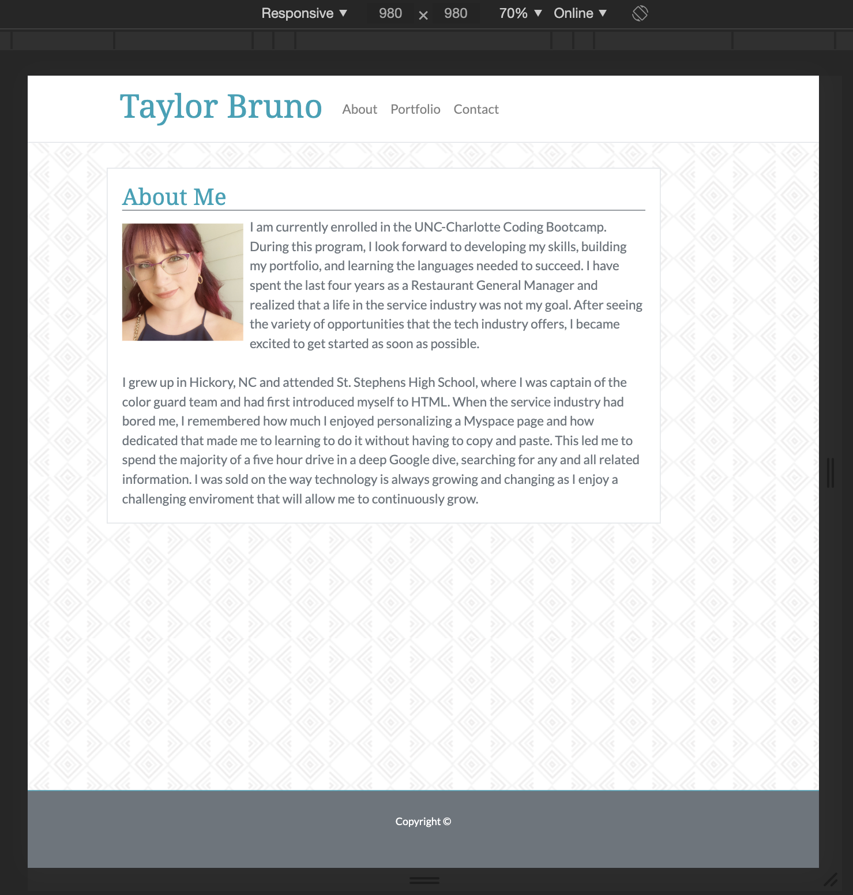
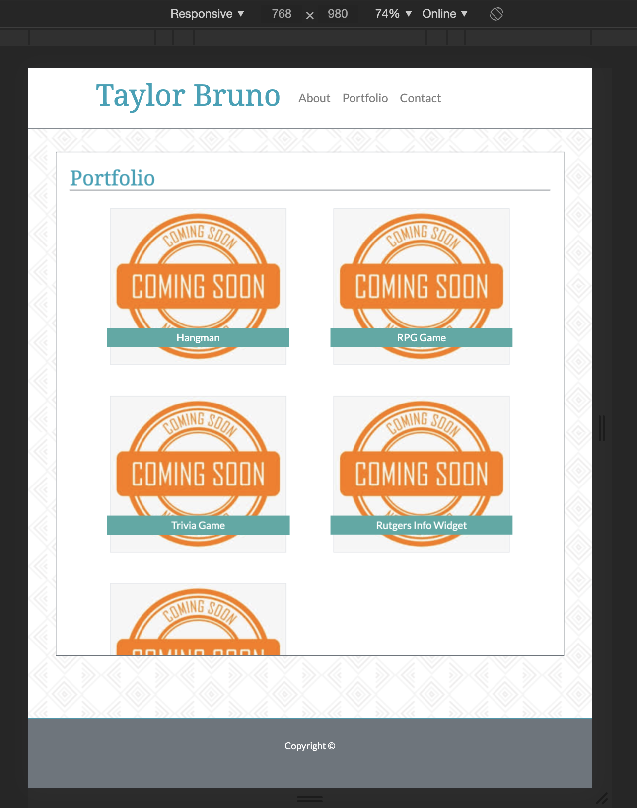
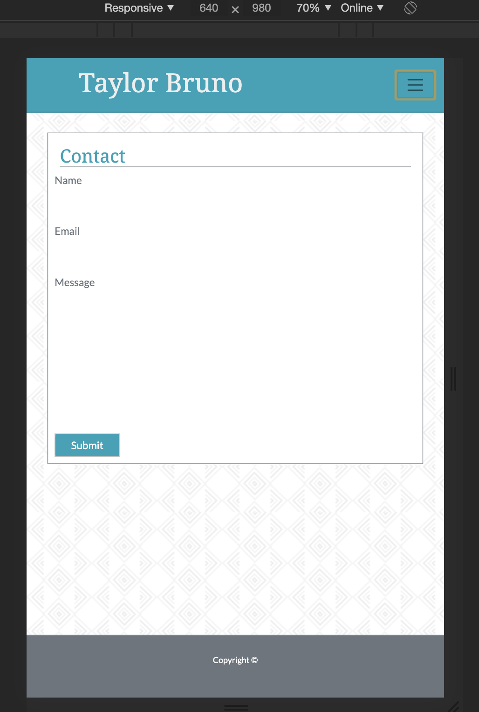

# Responsive Portfolio: Taylor Bruno

### Getting Started
[Click to view the completed assignment.](https://taylormbruno.github.io/)

##### The [Original Repositiory](https://github.com/taylormbruno/hwUnit02) before moving to live. Original commits can be found here.

### Description
This is my responsive portfolio created to allow clear content across multiple devices and screen sizes while also minimizing the use of media queries.

### Assignemnt
>Use the Bootstrap CSS Framework to recreate your portfolio.

### Built With
- HTML
- CSS

## Credits
- [Bootstrap](https://getbootstrap.com/)

## Screenshots
    
